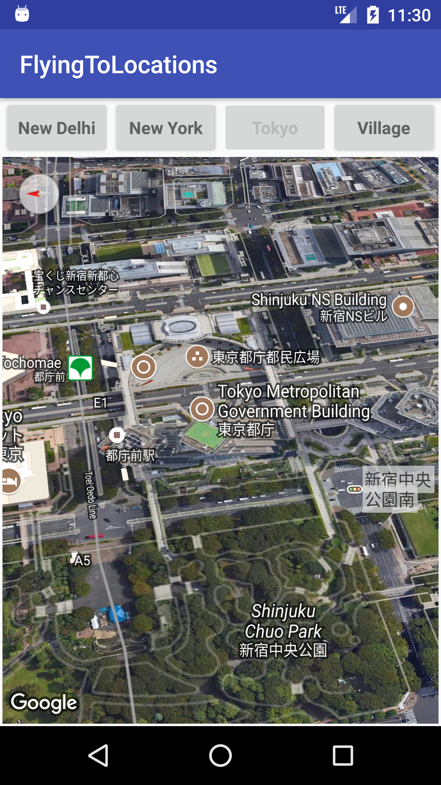
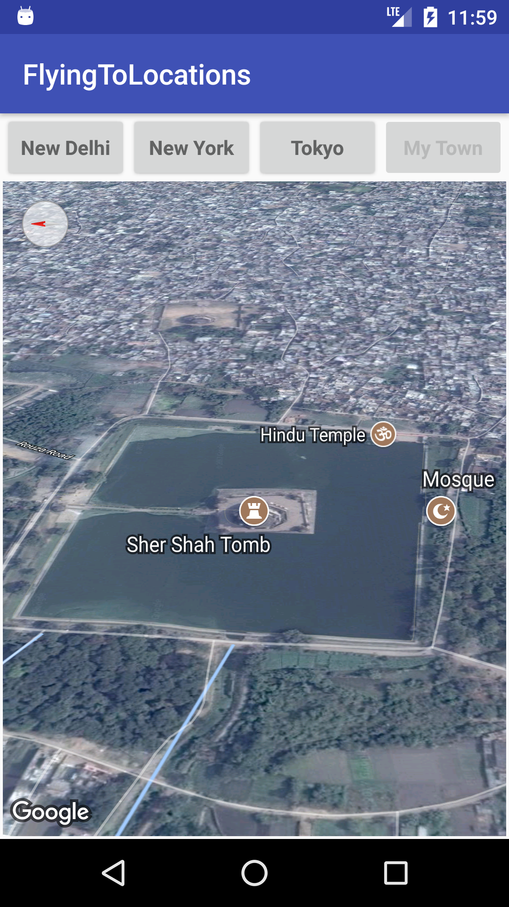

# GoogleMapsAndLocationServices - FlyingToLocation

this repository uses **AnimateCamera Attribute** of **GoogleMap** Class to get the flying effect to and from locations.

  

---
    
## for testing and better visibility These Coordinate  and attributes of **Camera Position class** are being used :

### For New Delhi
```java
static final CameraPosition DELHI = CameraPosition.builder().
            target(new LatLng(28.6129, 77.2295)).
            zoom(17).
            bearing(0).
            tilt(65).
            build();
 ```
 ---
 ### For New York
 ```java
 static final CameraPosition NEWYORK = CameraPosition.builder().
            target(new LatLng(40.7484, -73.9857)).
            zoom(17).
            bearing(0).
            tilt(65).
            build();
```
---
 ### For Tokyo 
```java
    static final CameraPosition TOKYO = CameraPosition.builder().
            target(new LatLng(35.6895, 139.6917)).
            zoom(17).
            bearing(90).
            tilt(45).
            build();
```
---
```java
   static final CameraPosition HOMETOWN= CameraPosition.builder().
            target(new LatLng(24.9481, 84.0093)).
            zoom(17).
            bearing(90).
            tilt(65).
            build();

```
---


|               Fly to Newyork               |               Fly t oTokyo               |      Fly to Home        |
| :------------------------------------: | :------------------------------------: | :-----------------------: |
|   |          |  |
