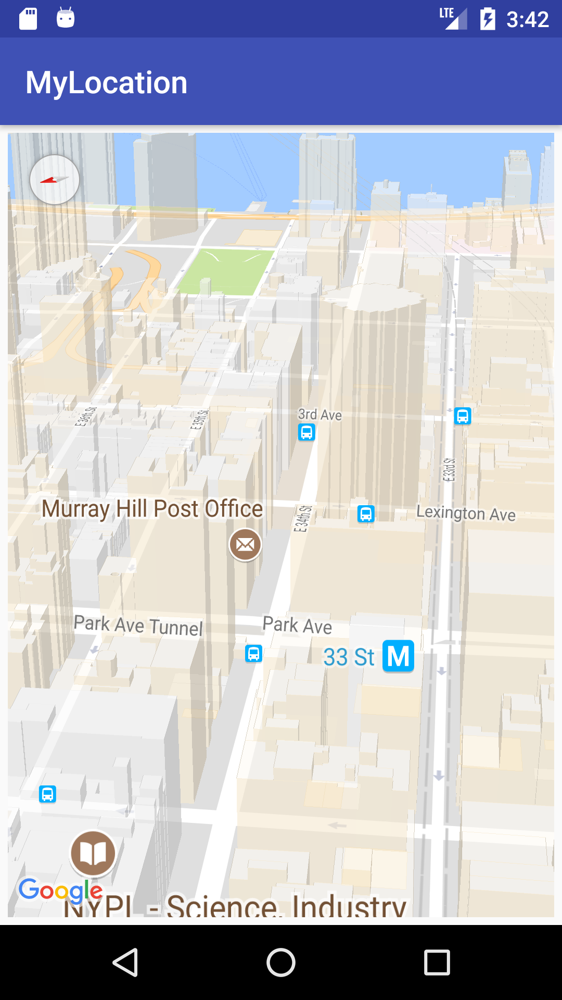

# GoogleMapsAndLocationServices - MyLocation

this repository uses **MapFragment** in xml files with specific coordinate
##Attribute 
- Longitude
- Latittude
- Bearing
- Zoom
- Tilt

## for testing and better visibility Co- ordinate of New York is used which is:
> New York, USA         **lat = 40.7484**,   **lng = -73.9857**

