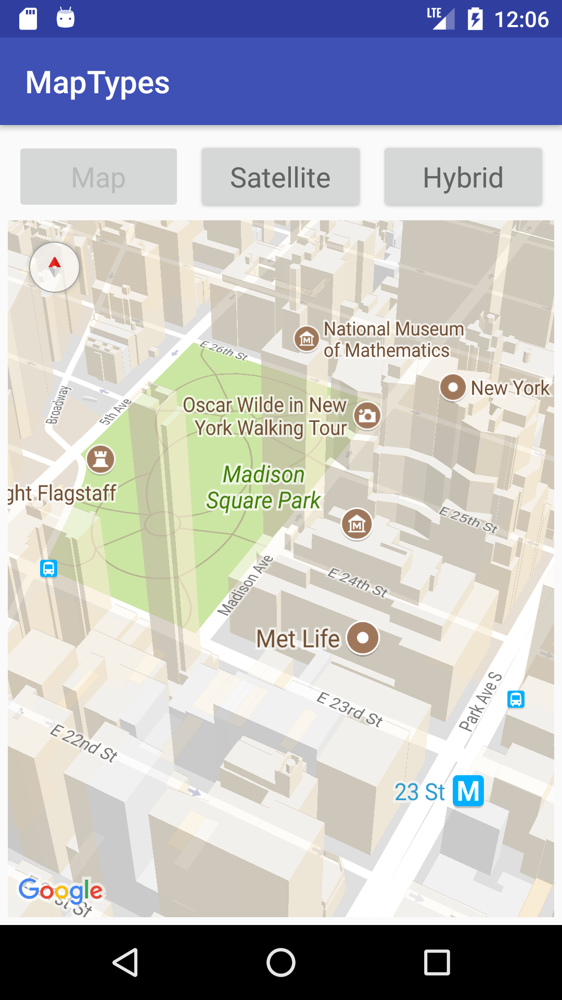
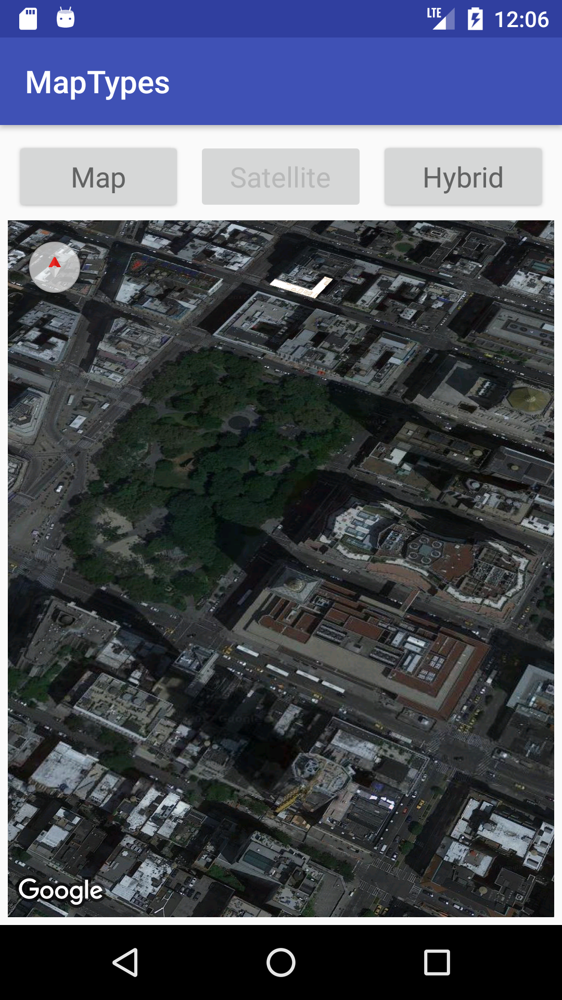
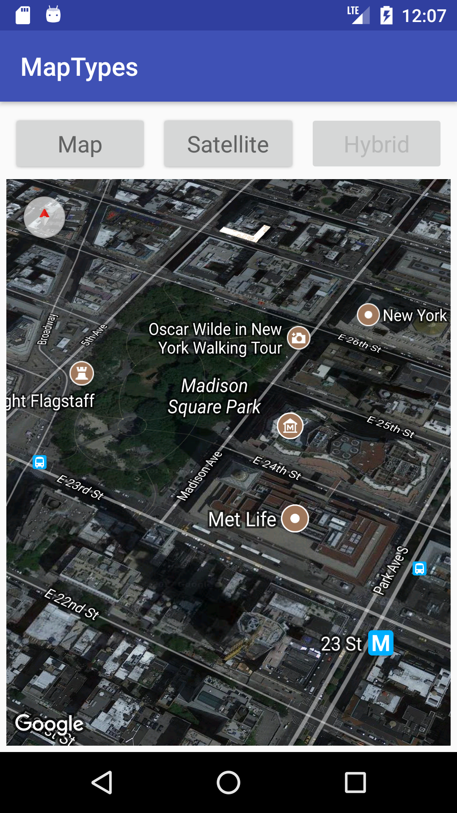

# GoogleMapsAndLocationServices - MapTypes

this repository uses different **MapTypes** Programmatically  with specific coordinate

  

---

* **Map Types:**
  * Normal Map
    > displays the default road map view. This is the default map type.
  * Satellite
    > displays Google Earth satellite images
  * Hybrid
    > displays a mixture of normal and satellite views
    
---
## for testing and better visibility Co- ordinate of New York is used which is:
> New York, USA         **lat = 40.7484**,   **lng = -73.9857**
---

|               Normal Map               |               Satellite Image               |      Hybrid         |
| :------------------------------------: | :------------------------------------: | :-----------------------: |
|   |          |  |
